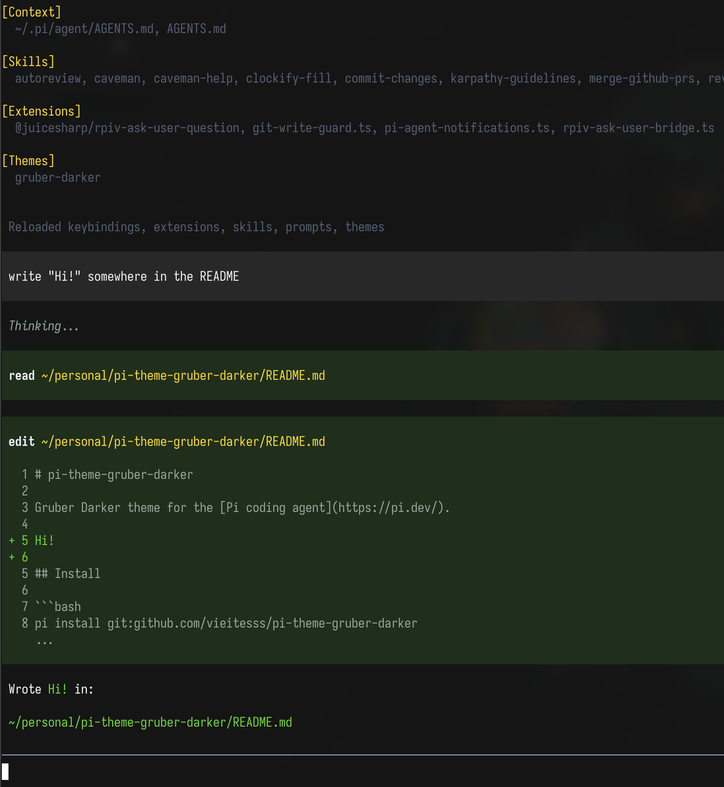

<div align="center">
  
</div>

# pi-theme-gruber-darker

Gruber Darker and Gruber Lighter themes for the [Pi coding agent](https://pi.dev/).

## Install

```bash
pi install git:github.com/vieitesss/pi-theme-gruber-darker
```

Then select `gruber-darker` or `gruber-lighter` in `/settings`, or set:

```json
{
  "theme": "gruber-lighter"
}
```

## Themes

- [`gruber-darker`](themes/gruber-darker.json)
- [`gruber-lighter`](themes/gruber-lighter.json)
